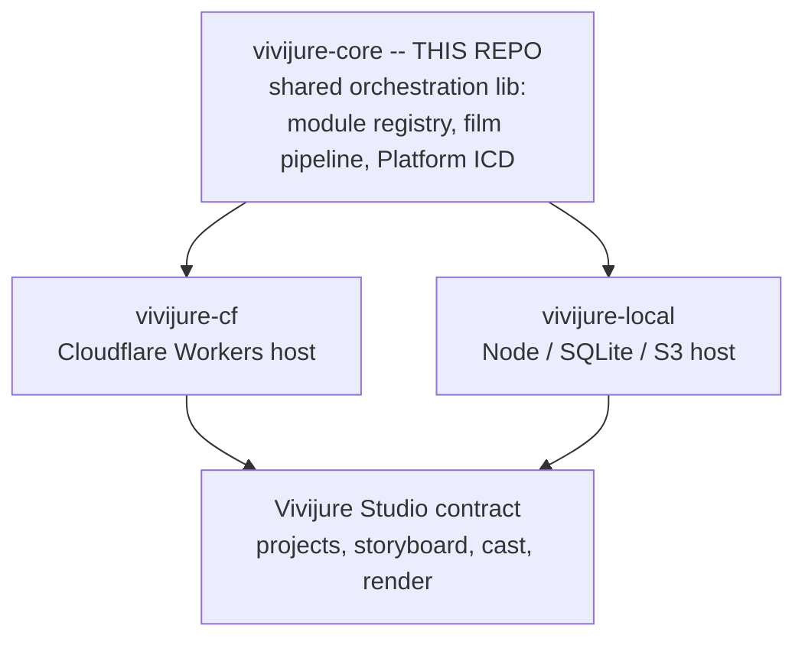

# @skyphusion-labs/vivijure-core

**Shared orchestration that unifies both Vivijure control panels.** Module registry, film pipeline,
planner helpers, and the **Platform ICD** that lets one codebase run on Cloudflare Workers
([`vivijure-cf`](https://github.com/skyphusion-labs/vivijure-cf)) or on a home computer / any cloud
server ([`vivijure-local`](https://github.com/skyphusion-labs/vivijure-local)). Product site:
[vivijure.com](https://vivijure.com).

| Consumer | Role |
|----------|------|
| [`vivijure-cf`](https://github.com/skyphusion-labs/vivijure-cf) | CF-native control plane (D1, R2, service bindings) |
| [`vivijure-local`](https://github.com/skyphusion-labs/vivijure-local) | Homelab control plane (SQLite, S3/MinIO, HTTP sidecars) |

**Status:** Published on npm as `@skyphusion-labs/vivijure-core` and consumed by both hosts.
`vivijure-cf` has adopted the published package (no duplicate orchestration `src/` remains) and
`vivijure-local` consumes it via semver.

**Vivijure Studio:** https://vivijure.com · **Live demo:** https://demo.vivijure.com · **Skyphusion Labs:** https://skyphusion.org

## Where it fits

`vivijure-core` is a library, not a runnable app: host repos depend on it and provide the runtime
(Cloudflare Workers or Node). It has no end-user surface of its own; you consume it, you do not deploy it.



## Layout

```
src/
  platform/          Platform ICD + orchestratorContextFromPlatform()
  modules/           vivijure-module/2 contract, registry, conformance
  film-*.ts          Film + clip orchestration
  *-db.ts            D1-shaped metadata helpers (DbEnv)
  preflight.ts       Planner pre-render validation
  ...
docs/
  PLATFORM.md        Frozen adapter contract (ICD v1)
  ARCHITECTURE.md    Package boundary + dependency rules
  CORE-VS-MODULES.md Planner scaffold vs swappable modules (canonical)
  HOST-ADOPTION.md   CF + local host migration checklist
```

## Install

**npm (consumers):**

```bash
npm install @skyphusion-labs/vivijure-core
```

**Sibling clone (vivijure-local / vivijure dev):**

```
~/dev/
  vivijure-core/
  vivijure-local/    # package.json: "^0.9.0" -- override with file:../vivijure-core locally
  vivijure-cf/
```

```bash
cd vivijure-core
npm ci
npm run build   # emits dist/ (also runs on npm install via prepare)
npm run typecheck && npm test
```

**Publish** (maintainers): merge to `main`, bump `package.json`, update `RELEASES.md` + `CHANGELOG.md`,
ensure repo secret `NPM_TOKEN` is set, then:

```bash
git tag vivijure-core-v1.2.2
git push origin vivijure-core-v1.2.2
gh release create vivijure-core-v1.2.2 --title "vivijure-core v1.2.2" --notes-file notes.md
```

Tag push triggers **Publish npm package** (`.github/workflows/publish-npm.yml`). GitHub Releases are
**manual** (see [`RELEASES.md`](RELEASES.md)); npm CI does not create them.

**flatliners** (Hetzner test box): **retired 2026-07-16**. Historical notes only:
[docs/FLATLINERS-DEV.md](docs/FLATLINERS-DEV.md). Active GPU/studio host is **propagandhi**.

## Key exports

| Entry | Contents |
|-------|----------|
| `@skyphusion-labs/vivijure-core` | Barrel: registry, orchestrators, conformance, ... |
| `@skyphusion-labs/vivijure-core/platform` | `Platform`, `orchestratorContextFromPlatform`, R2 shim |
| `@skyphusion-labs/vivijure-core/film-orchestrator` | Full film state machine |
| `@skyphusion-labs/vivijure-core/preflight` | Storyboard pre-render checks |

Full subpath list: `package.json` `exports` field.

## Platform ICD

Orchestration never touches Worker bindings or `process.env` directly. Hosts implement `Platform`
(see [docs/PLATFORM.md](docs/PLATFORM.md)) and pass `orchestratorContextFromPlatform(platform)`
into ported handlers.

## License

AGPL-3.0-only. Same as the rest of the Vivijure constellation.
